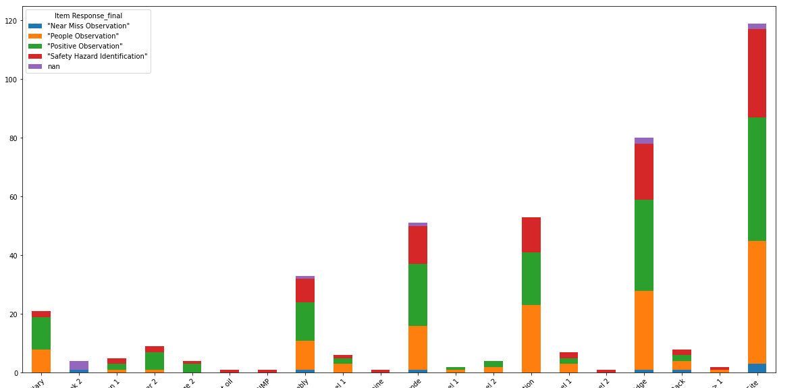

# Checklists_Demo

The original file is Checklist Detail.csv exported from BIM 360 Data Connnector. This demo utilized Pandas to present the distributions of customized responses from BIM 360 Checklist by location, which was imposisble to implement with Excel. 

The final chart requested by client is shown as below. It illustrates the most frequent responses by locations. 

